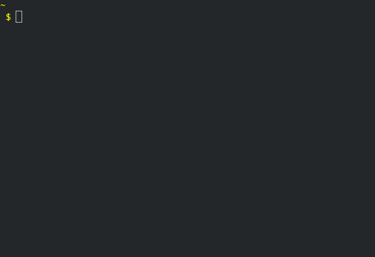

# Jersey - where you go when you need to get things done

A command line interface (CLI) to-do/backlog tool to stay organized. This uses Trello as a backend with an opinionated workflow.



# Install

```
$ git clone https://github.com/tstringer/jersey.git
$ cd jersey
$ sudo make
```

# Configuration

Jersey not only uses Trello as a backend, but also the awesome [py-trello](https://github.com/sarumont/py-trello) wrapper around the API. Because of this, there are a few steps you need to take before you can use Jersey. Some of the steps below are from py-trello requirements/documention.

1. Create a Trello account if you don't already have one
1. Create Trello board named `Backlog` (this is currently not configurable, but if there is enough desire to make this configurable I can develop that into the product)
1. Create the following lists in your new Backlog board: `need_to_do`, `doing`, `blocked`, `done` (again, this is not configurable, but if there is interest then please create an issue on this repo)
1. (Optionally) create labels that are relevant to your requirements (my labels are `work`, `personal`, `pressing`, and `urgent`. Feel free to use these same ones, or create as few or many as you desire)
1. Set the following environment variables. The API key and secret for your Trello account can be found here
    - `TRELLO_API_KEY`
    - `TRELLO_API_SECRET`
    - `TRELLO_EXPIRATION` (optionally set this to `never` for the token to never expire)
1. From the root directory of Jersey, run the following: `$ python venv/lib/python3.6/site-packages/trello/util.py`
1. The output from running that py-trello utility will be used to now set the following environment variables
    - `TRELLO_TOKEN`
    - `TRELLO_TOKEN_SECRET`

# Usage

```
usage: nj [-h] {list,show,move,add,labels,comment,sort} ...

positional arguments:
  {list,show,move,add,labels,comment,sort}
    list                list things
    show                display a card and contents
    move                move a card to a different list
    add                 add a new card
    labels              list labels
    comment             add a comment to a card
    sort                sort all cards in the bard

optional arguments:
  -h, --help            show this help message and exit
```

:bulb: Each sub command has its own help menu to display possible args. E.g. `$ nj add --help`

## Examples

Show all active lists (need_to_do, doing, and blocked)

```
$ nj
```

Show a particular list: `nj list <list_name>`

```
$ nj list doing
```

Show details about a card (including comments): `nj show <card_id>`. `card_id` is retrieved from the `nj list` command

```
$ nj show 50e
```

Display all available labels

```
$ nj labels
```

Add a new card: `nj add <card_name> <list_name> -d <due_date> -l <labels>` (due_date and labels are optional)

```
$ nj add 'review pull request' doing -d today -l work
$ nj add 'review pull request' doing -d today
$ nj add 'review pull request' doing -l work
$ nj add 'review pull request' doing
```

Add a comment to a card: `nj comment <card_id> <comment>`

```
$ nj comment 50e 'waiting on pull request author to reply'
```

Move a card to a different list: `nj move <card_id> <list_name>`

```
$ nj move 50e done
```

Sort all cards in all lists (this happens by-list when you add a new card)

```
$ nj sort
```
